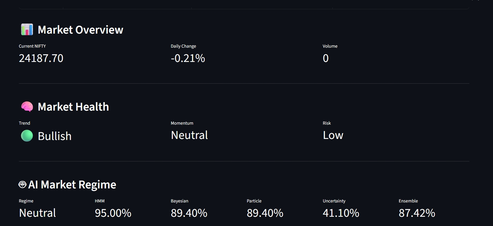
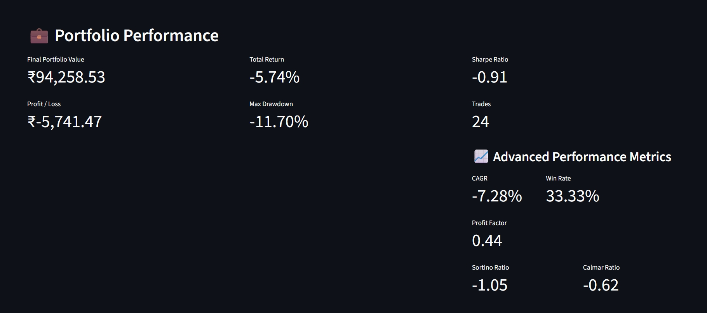
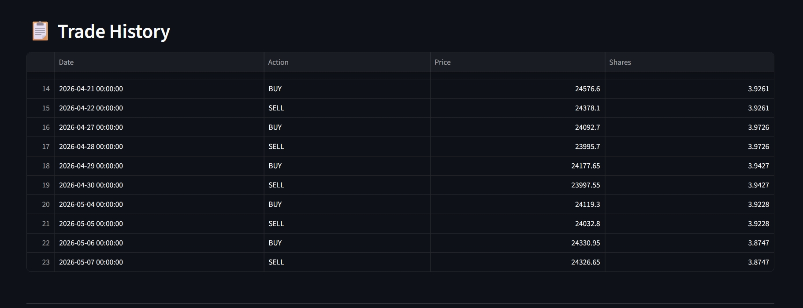
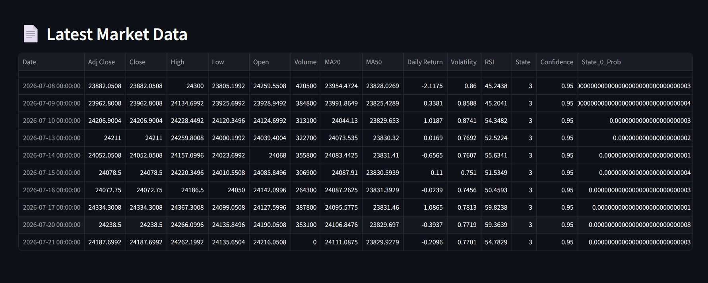

# 📈 QuantVision AI
[](https://quantvision-bayesian-ns.streamlit.app/)
## Bayesian Regime Detection Engine for Indian Equity Markets

QuantVision AI is an AI-powered financial analytics platform that detects market regimes using probabilistic machine learning and Bayesian inference techniques. The application combines multiple AI models to estimate market uncertainty, generate explainable investment recommendations, simulate portfolio performance, and visualize insights through an interactive Streamlit dashboard.

---

# 🎯 Project Objective

The objective of QuantVision AI is to build an intelligent decision-support system for Indian equity markets by integrating machine learning, Bayesian statistics, and quantitative finance techniques into a single analytics platform.

The system helps investors understand current market conditions, estimate prediction confidence, evaluate portfolio performance, and compare strategy returns with a Buy & Hold benchmark.

---

# 🚀 Features

### 📊 Market Data
- Live NSE Index data using Yahoo Finance
- Automatic historical data download
- Data preprocessing and cleaning

### 📈 Technical Indicators
- Relative Strength Index (RSI)
- Moving Average Convergence Divergence (MACD)
- Bollinger Bands
- Average True Range (ATR)
- Rolling Volatility

### 🤖 AI & Machine Learning Pipeline

#### Hidden Markov Model
- Detects Bull, Bear and Sideways market regimes
- Calculates regime confidence

#### Bayesian Inference Engine
- Updates regime probabilities
- Computes posterior probabilities
- Estimates uncertainty using entropy

#### Particle Filter
- Smooths Bayesian estimates
- Improves confidence estimation

#### Conformal Prediction
- Generates adaptive confidence intervals
- Quantifies prediction uncertainty

#### Ensemble Prediction
- Combines outputs from multiple AI models
- Produces robust market predictions

---

# 💼 Investment Decision Engine

- Portfolio Allocation Guidance
- AI Buy Recommendation
- AI Sell Recommendation
- Hold Recommendation
- Explainable Recommendation Reasons

---

# 📊 Portfolio Analytics

Portfolio simulator includes:

- AI Trading Strategy
- Buy & Hold Benchmark
- Portfolio Value Tracking
- Trade History

### Performance Metrics

- Total Return
- CAGR
- Sharpe Ratio
- Sortino Ratio
- Calmar Ratio
- Maximum Drawdown
- Win Rate
- Profit Factor
- Number of Trades

---

# 📈 Interactive Dashboard

Built using Streamlit.

Dashboard includes:

- Market Price Chart
- Buy/Sell Signal Visualization
- RSI Chart
- Volatility Chart
- Portfolio Performance
- Buy & Hold Comparison
- Portfolio Metrics
- Trade History
- Latest Market Data

---

# 📥 Export Features

- Download Complete Analysis (CSV)
- Download Trade History (CSV)
- Generate PDF Performance Report

---

# 🏗 System Workflow

```text
Yahoo Finance
      │
      ▼
Market Data Loader
      │
      ▼
Technical Indicators
      │
      ▼
Hidden Markov Model
(Regime Detection)
      │
      ▼
Bayesian Updating
      │
      ▼
Particle Filter
      │
      ▼
Conformal Prediction
      │
      ▼
Ensemble Prediction
      │
      ▼
Portfolio Allocation
      │
      ▼
Recommendation Engine
      │
      ▼
Portfolio Simulation
      │
      ▼
Performance Analytics
      │
      ▼
CSV / PDF Export
      │
      ▼
Streamlit Dashboard
```

---

# 🛠 Technology Stack

| Category | Technology |
|-----------|------------|
| Programming Language | Python 3.12 |
| Dashboard | Streamlit |
| Data Analysis | Pandas, NumPy |
| Machine Learning | hmmlearn, Scikit-learn |
| Data Source | Yahoo Finance (yfinance) |
| Visualization | Plotly |
| Reporting | ReportLab |
| Version Control | Git & GitHub |

---

# 📂 Project Structure

```text
QuantVision-AI/

├── app.py
├── data_loader.py
├── indicators.py
├── regime_detector.py
├── bayesian_engine.py
├── particle_filter.py
├── conformal.py
├── ensemble.py
├── allocation.py
├── recommendation.py
├── portfolio.py
├── charts.py
├── report_generator.py
├── requirements.txt
├── README.md
├── run.bat
└── .gitignore
```

---

# ⚙ Installation

Clone the repository

```bash
git clone https://github.com/nischalsingh018/QuantVision-AI.git

cd QuantVision-AI
```

Create virtual environment

```bash
python -m venv venv312
```

Install dependencies

```bash
pip install -r requirements.txt
```

Run the application

```bash
.\venv312\Scripts\python.exe -m streamlit run app.py
```

---
## 📷 Dashboard Preview

### Dashboard


### Portfolio Performance


### Trade History


### Performance Metrics


---

# 🌐 Live Demo
[Launch QuantVision AI](https://quantvision-bayesian-ns.streamlit.app/)

 
---

# 💡 Skills Demonstrated

- Python Programming
- Machine Learning
- Bayesian Statistics
- Hidden Markov Models
- Time Series Analysis
- Quantitative Finance
- Portfolio Analytics
- Financial Risk Analysis
- Streamlit Dashboard Development
- Data Visualization
- Git & GitHub

---

# 🔮 Future Enhancements

- Real-time Market Streaming
- Multi-Asset Portfolio Support
- Deep Learning Price Forecasting (LSTM / Transformer)
- Explainable AI (XAI)
- Portfolio Optimization
- Risk Management Dashboard
- Sentiment Analysis Integration

---
## 👨‍💻 Author

**Nischal Singh**

Finance Student | AI & Machine Learning Enthusiast

- GitHub: https://github.com/nischalsingh018
- LinkedIn: https://linkedin.com/in/nischal-singh-00548a38b

## 🌟 Areas of Interest

- Artificial Intelligence
- Machine Learning
- Quantitative Finance
- Financial Analysis
- Capital Markets

# 📄 License

This project was developed for educational, internship, and portfolio purposes.

---

## ⭐ Acknowledgement

This project demonstrates the application of probabilistic machine learning, Bayesian inference, and quantitative finance concepts for intelligent market analysis and investment decision support.

If you found this project useful, consider giving it a ⭐ on GitHub.